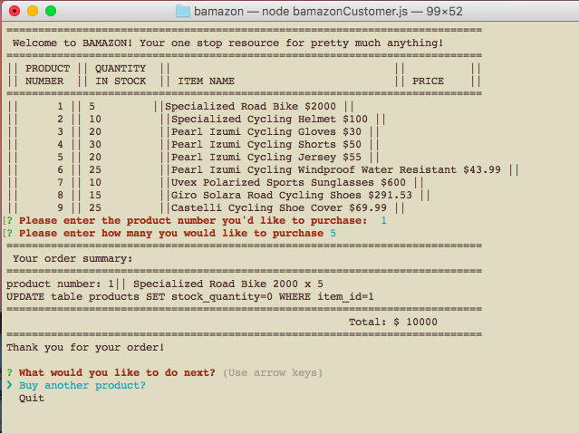
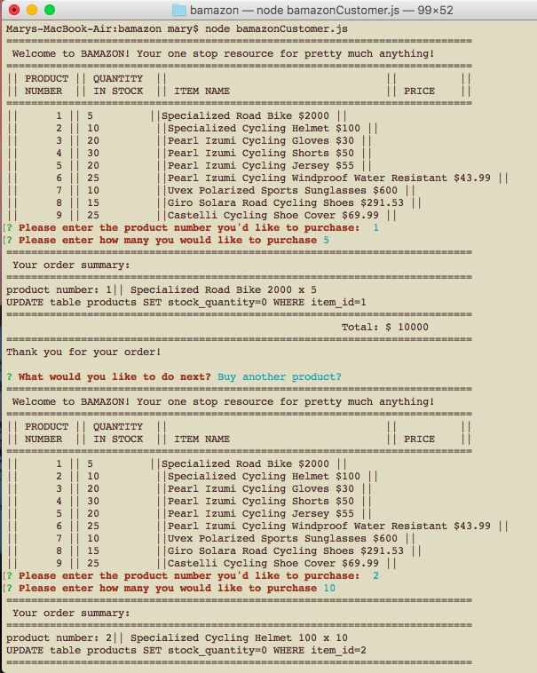

# bamazon
##node application like Amazon

the user is shown a list of products from the database,

the user is then asked to enter the product id
and the quantity

the user is then given the total amount 

