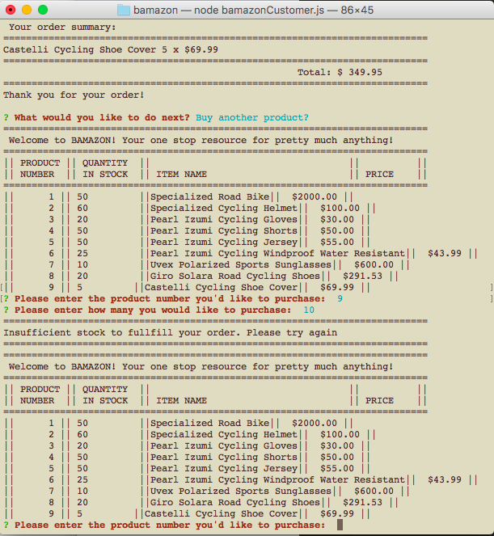
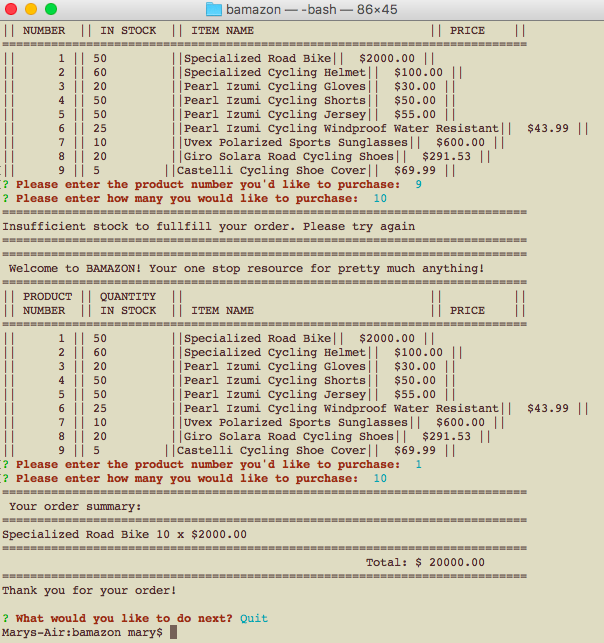

# bamazon
## node application like Amazon

### User view
the user is shown a list of products from the database,

the user is then asked to enter the product id
and the quantity. and outputs the total amount for the item selected and qty given

User is asked what they want to do next, given a selection of Buy more product or
Quit. This time, the user enters a product and a quantity more than available.

the program then spits out an error message that says "insufficient quantity to fulfill the order"
then gives the option to select a product again, when given quantity that is less than equal the 
available, the program finishes with running total as well as the option again to Buy again or quit.

## Manager View

In the Manager module, managers can:
1. view the products for sale
1. view low inventory
1. add inventory
1. add new product for sale

Show Manager Selection:

Show all items for sale:

Show Low Inventory - any items with quantity less than five

Add to Inventory - User enters Product ID and quantity to add to current inventory

Add new product - The user enters all the information about the new product that will be added

New product added to the list:

